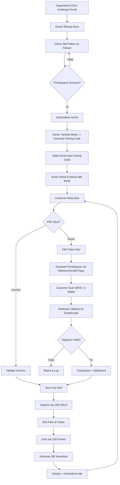
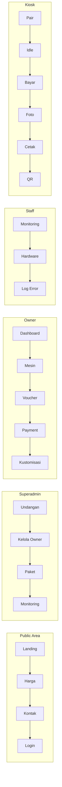

# SnapArcade — Platform Photobooth SaaS Cross-Platform

---

## 1. Ringkasan & Tujuan Aplikasi
*Bagian ini menjelaskan gambaran umum proyek agar dipahami bersama oleh pemilik ide/klien dan tim pengembang.*
- **Nama Aplikasi**: SnapArcade
- **Penjelasan Singkat**: SnapArcade adalah platform SaaS photobooth cross-platform yang menggabungkan aplikasi Kiosk self-service bergaya Neobrutalism (berjalan di iPad/iOS & Android) dengan sistem manajemen terpusat berbasis web bergaya profesional (Shadcn UI) untuk Owner Photobooth, Staff lapangan, dan Superadmin platform.
- **Masalah yang Diselesaikan**:
  - Operator photobooth kesulitan mengelola banyak mesin kiosk di lokasi berbeda karena tidak ada sistem monitoring dan kontrol terpusat.
  - Pemilik usaha photobooth tidak bisa mengontrol langsung arus kas pembayaran karena selalu bergantung pada satu payment gateway pihak ketiga (settlement tertunda & terpotong biaya platform).
  - Sulit melakukan kustomisasi tampilan, harga, dan voucher per klien acara tanpa harus mengubah kode aplikasi.
  - Integrasi hardware kamera DSLR/Mirrorless dan printer foto profesional via kabel USB masih dilakukan secara manual dan tidak terstandarisasi.
  - Tidak ada visibilitas analitik pendapatan, jumlah sesi, dan kondisi perangkat secara real-time.
- **Pengguna Aplikasi**:
  - **Superadmin**: Mengelola pendaftaran Owner (tertutup/undangan), memantau seluruh aktivitas platform, dan mengatur paket langganan.
  - **Owner Photobooth**: Klien SaaS berlangganan yang membutuhkan dashboard analitik, manajemen mesin, kustomisasi tampilan, voucher, dan integrasi payment gateway pribadi.
  - **Staff**: Petugas lapangan yang membutuhkan akses terbatas untuk troubleshooting kiosk, cek hardware, dan pengecekan printer/kertas.
  - **Customer (Kiosk Mode)**: End-user yang berinteraksi langsung dengan tablet kiosk untuk membayar, berfoto, mengedit, mencetak, dan mengunduh hasil.
- **Target Keberhasilan**:
  - Onboarding Owner baru dari undangan sampai kiosk pertama aktif beroperasi < 1 hari kerja.
  - Tingkat keberhasilan transaksi pembayaran di kiosk (payment success rate) ≥ 95%.
  - Rata-rata downtime kiosk per bulan < 2% dari total jam operasional.
  - Owner dapat memonitor seluruh mesinnya (status online/offline, sesi hari ini, pendapatan) dalam waktu < 3 detik setelah login.

---

## 2. Batasan Pembuatan Sistem (Versi Awal MVP)
*Menegaskan fitur apa yang dikerjakan di versi awal dan apa yang sengaja ditunda agar aplikasi cepat selesai dan tidak membengkak (mencegah scope creep).*

### ✅ Yang Dikerjakan:
- Landing page publik profesional bergaya Neobrutalism dengan pendaftaran Owner **tertutup** (hanya via undangan Superadmin).
- Autentikasi berbasis Supabase Auth dengan sistem Undangan Email (magic link invite) yang dikirim Superadmin.
- Dashboard Superadmin: kelola undangan, kelola Owner, kelola paket langganan, monitor subscription & transaksi global.
- Dashboard Owner (Shadcn): analitik pendapatan & sesi, manajemen kiosk, kustomisasi tampilan kiosk (warna, logo, frame), manajemen voucher, pengaturan credential Midtrans/Xendit/Tripay, manajemen staff, riwayat transaksi, langganan & invoice Pakasir.
- Dashboard Staff: monitoring status kiosk, riwayat sesi, hardware diagnostics (kamera & printer), cek log error.
- Kiosk App (PWA installable) dengan alur lengkap: pairing code, halaman idle, pemilihan paket, pembayaran (QRIS/e-Wallet), input voucher, sesi foto (capture, retake, zoom), edit filter, preview cetak, cetak ke printer USB, QR download hasil.
- Integrasi WebUSB untuk kontrol DSLR/Mirrorless (via gPhoto2 bridge / WebUSB PTP) dan Printer foto USB (via ESC/POS & vendor-specific driver).
- Integrasi Pakasir untuk langganan B2B Owner.
- Integrasi Midtrans / Xendit / Tripay untuk pembayaran Customer di Kiosk (direct settlement ke akun Owner).
- Sistem notifikasi in-app untuk semua peran.

### ⛔ Yang Tidak Dikerjakan di Versi Awal:
- Aplikasi native iOS/Android terpisah (Cocoa/Android Studio) — MVP hanya PWA + WebUSB.
- Dukungan multi-bahasa (i18n). Bahasa default Bahasa Indonesia.
- Integrasi WhatsApp Business API, SMS, atau email transaksional selain magic link undangan.
- AI face-beautify / auto-lighting / background removal.
- Multi-currency dan multi-negara.
- Marketplace template frame dari pihak ketiga.
- Sistem afiliasi/referral berjenjang.
- Mode offline penuh tanpa koneksi internet (kiosk wajib online untuk verifikasi token).

---

## 3. Daftar Halaman & Struktur Menu (Pages & Routing)
*Daftar lengkap halaman yang harus dibuat, dikelompokkan berdasarkan area atau peran pengguna.*

### A. Public Area (Tanpa Login)
- `/` (**Beranda**): Landing page Neobrutalism dengan hero bold, penjelasan produk, showcase fitur (analitik, hardware, custom layar), paket harga, testimoni, CTA "Hubungi Sales" (karena pendaftaran tertutup).
- `/fitur` (**Fitur**): Penjelasan detail modul SaaS, foto hardware, dan alur kiosk dengan ilustrasi berwarna.
- `/harga` (**Harga**): Tabel paket langganan berdasarkan jumlah mesin + add-on sesi tambahan.
- `/tentang` (**Tentang Kami**): Visi SnapArcade, tim, dan cerita di balik produk.
- `/kontak` (**Kontak**): Form kontak (terhubung ke notifikasi admin in-app) + info email support.
- `/masuk` (**Login**): Halaman login untuk Superadmin, Owner, dan Staff via Supabase Auth.
- `/undangan/[token]` (**Aktivasi Undangan**): Halaman aktivasi akun Owner/Staff dari magic link undangan Superadmin.
- `/syarat-ketentuan` (**Syarat & Ketentuan**), `/kebijakan-privasi` (**Kebijakan Privasi**), `/faq` (**FAQ**).

### B. Superadmin Area
- `/admin` (**Dashboard Global**): Ringkasan total Owner, kiosk aktif, subscription berjalan, dan revenue platform.
- `/admin/undangan` (**Undangan**): Generate & kirim undangan email ke Owner/Staff baru, tracking status undangan.
- `/admin/owner` (**Kelola Owner**): List Owner, filter status subscription, detail Owner, aktivasi/suspend akun.
- `/admin/owner/[id]` (**Detail Owner**): Data bisnis, jumlah mesin, riwayat subscription, riwayat transaksi Pakasir.
- `/admin/paket` (**Paket Langganan**): CRUD paket (nama, limit mesin, harga flat bulanan, kuota sesi included, harga add-on).
- `/admin/langganan` (**Semua Subscription**): List subscription aktif & expired, invoice Pakasir, status pembayaran.
- `/admin/transaksi` (**Transaksi Global**): List transaksi langganan Pakasir & agregat transaksi kiosk lintas Owner.
- `/admin/mesin` (**Monitoring Kiosk**): Real-time status seluruh kiosk di semua Owner (online/offline/maintenance).
- `/admin/pengguna` (**Pengguna**): List semua user di platform (Superadmin, Owner, Staff).
- `/admin/log-aktivitas` (**Log Aktivitas**): Audit log seluruh aksi sensitif di platform.
- `/admin/notifikasi` (**Notifikasi In-App**).
- `/admin/pengaturan` (**Pengaturan Sistem**).

### C. Owner Photobooth Area
- `/dashboard` (**Dashboard Utama**): Kartu statistik pendapatan hari ini/bulan ini, total sesi, kiosk online, grafik tren 30 hari.
- `/dashboard/mesin` (**Manajemen Mesin**): List kiosk, status, limit sesi, tombol pairing, tombol edit pengaturan.
- `/dashboard/mesin/[id]` (**Detail Mesin**): Tab Pengaturan Kamera (aperture, ISO, shutter, resolusi), Tab Pengaturan Printer (kertas, layout, test print), Tab Limit Sesi, Tab Log Perangkat.
- `/dashboard/sesi` (**Riwayat Sesi**): List sesi foto dengan filter tanggal, mesin, dan status pembayaran; detail sesi berisi preview foto & data pelanggan.
- `/dashboard/transaksi` (**Transaksi & Laporan**): List transaksi customer dengan status settlement, export CSV/PDF laporan.
- `/dashboard/voucher` (**Manajemen Voucher**): CRUD voucher (persentase, fixed, sesi gratis), kuota, masa berlaku.
- `/dashboard/payment` (**Pengaturan Payment Gateway**): Form input credential Midtrans/Xendit/Tripay (sandbox & production), checklist verifikasi.
- `/dashboard/kustomisasi` (**Kustomisasi Kiosk**): Live preview layar kiosk + form kustomisasi (warna background, warna tombol, logo, frame, teks welcome).
- `/dashboard/langganan` (**Langganan Saya**): Paket aktif, limit mesin, kuota sesi, tombol upgrade & beli add-on via Pakasir.
- `/dashboard/staff` (**Manajemen Staff**): Undang staff, cabut akses, atur izin staff.
- `/dashboard/notifikasi` (**Notifikasi**).
- `/dashboard/pengaturan` (**Pengaturan Akun**).

### D. Staff Area
- `/staff` (**Dashboard Staff**): Status kiosk yang ditugaskan, alert hardware yang perlu dicek.
- `/staff/mesin/[id]` (**Detail Kiosk Staff**): Status kamera & printer, tombol test print, restart kiosk remote, lihat log error terbaru.
- `/staff/sesi` (**Riwayat Sesi Lokal**): Sesi yang terjadi di kiosk yang ditugaskan.
- `/staff/hardware` (**Diagnostik Hardware**): Panel USB deteksi kamera & printer, status koneksi, opsi reconnect.
- `/staff/notifikasi` (**Notifikasi Staff**).

### E. Kiosk Mode (PWA Fullscreen, Neobrutalism)
- `/kiosk` (**Entry**): Layar pembuka kiosk, memeriksa token pairing & koneksi.
- `/kiosk/pair` (**Pairing Arcade**): Input kode pairing 6-digit, aktivasi mesin.
- `/kiosk/idle` (**Idle/Attract Mode**): Slideshow frame hasil foto, tombol besar "Mulai Foto".
- `/kiosk/pilih-paket` (**Pilih Paket Sesi**): Kartu paket sesi (mis. 1 strip, 4 foto; 2 strip, 8 foto) dengan harga & estimasi waktu.
- `/kiosk/pembayaran` (**Pembayaran**): Tampilan QRIS / e-Wallet, countdown timer, status loading real-time.
- `/kiosk/voucher` (**Input Voucher**): Input kode voucher/kupon.
- `/kiosk/sesi` (**Sesi Foto**): Countdown/capture berurutan, tombol retake, zoom, switch filter.
- `/kiosk/editor` (**Editor Foto**): Pilih frame, adjust filter (brightness, contrast, saturation), pilih photo layout.
- `/kiosk/preview-cetak` (**Preview Cetak**): Preview hasil cetak + jumlah copy + tombol konfirmasi cetak.
- `/kiosk/mencetak` (**Mencetak**): Progress bar printer + tombol ulang jika gagal.
- `/kiosk/hasil` (**Hasil**): QR Code download digital + tombol "Selesai" kembali ke idle.

---

## 4. Pedoman UI/UX & Design System
*Panduan visual konkret agar AI coding assistant tidak membuat UI yang kaku atau default.*

**SnapArcade memiliki DUA sistem desain yang terpisah secara sengaja**: Neobrutalism untuk area publik & kiosk, dan Shadcn UI profesional untuk seluruh dashboard.

### A. Design Token — Neobrutalism (Landing Page, Kiosk)
- **Skema Warna**:
  - Primary Yellow: `HSL(48, 100%, 50%)` / `#FFD60A`
  - Secondary Cyan: `HSL(188, 90%, 55%)` / `#22D3EE`
  - Accent Pink: `HSL(330, 85%, 62%)` / `#F472B6`
  - Accent Lime: `HSL(84, 85%, 55%)` / `#A3E635`
  - Ink/Black Border: `HSL(0, 0%, 4%)` / `#0A0A0A`
  - Background: `HSL(50, 100%, 97%)` / `#FFFDF0`
  - Foreground: `#0A0A0A`
- **Tipografi**:
  - Heading: **Space Grotesk** (700–800) — tebal, geometris, cocok untuk Neobrutalism.
  - Body: **Inter** (400–600).
  - Aksen (Harga, Badge): **Archivo Black** untuk emphasis.
- **Aturan Komponen Neobrutalism**:
  - Setiap kartu/tombol WAJIB memiliki `border-2 border-black` (atau `border-[3px]` untuk elemen besar).
  - Shadow keras: `shadow-[4px_4px_0px_0px_#0A0A0A]`, saat hover bergeser ke `shadow-[6px_6px_0px_0px_#0A0A0A]` dengan `-translate-x-[2px] -translate-y-[2px]`.
  - Sudut: `rounded-lg` atau `rounded-xl` — JANGAN full rounded, JANGAN tipis.
  - Tombol utama: background Primary Yellow + teks hitam bold + border hitam tebal.
  - Tidak ada gradient lembut. Kontras tinggi, warna solid, blok-blok besar.
  - Micro-animation: `transition-all duration-150 ease-out` pada hover & klik (efek tombol "tertekan").
- **Nuansa & Vibe**: Playful, energik, arcade-like, cocok untuk pengalaman foto yang menyenangkan. Ikon dari **Lucide** dengan `strokeWidth={3}`.

### B. Design Token — Dashboard (Shadcn UI)
- **Skema Warna** (menggunakan CSS variables Shadcn):
  - Primary: `HSL(221, 83%, 53%)` (blue-600).
  - Background: `HSL(0, 0%, 100%)`, secondary: `HSL(210, 40%, 96%)`.
  - Border: `HSL(214, 32%, 91%)` — border tipis `1px`.
  - Destructive: `HSL(0, 84%, 60%)`.
  - Radius: `0.625rem` (default Shadcn `rounded-lg`).
- **Tipografi**: Body **Inter** (400–500), Heading **Inter** (600–700). Gunakan tabular numerics untuk angka uang & statistik.
- **Aturan Komponen Shadcn**:
  - Gunakan komponen baku Shadcn UI: `Card`, `Table`, `Dialog`, `DropdownMenu`, `Tabs`, `Badge`, `Button`, `Input`, `Select`, `Toast (Sonner)`, `Chart (Recharts)`.
  - Shadow: `shadow-sm` untuk kartu biasa, `shadow-md` saat hover.
  - Spacing konsisten kelipatan 4px (gap-4, p-6).
  - Charts: gunakan palet chart Shadcn (Chart 1–5) untuk analitik pendapatan & sesi.
- **Nuansa & Vibe**: Bersih, profesional, data-dense, fokus pada keterbacaan angka & tren. Banyak whitespace antar section, tapi tabel dan chart padat informasi.

### C. Prinsip Responsif
- **Landing Page**: Mobile-first, hero bold 1 kolom di mobile, 2 kolom di desktop.
- **Dashboard**: Sidebar collapse menjadi Sheet di mobile; tabel scroll horizontal dengan sticky header.
- **Kiosk**: Dioptimalkan untuk **landscape 10"–12"** (iPad/Android tablet). Semua tombol minimal `h-16` atau `h-20` untuk touch target besar.

---

## 5. Pembagian Hak Akses Pengguna

| Menu / Halaman | Publik (Tanpa Login) | Customer (Kiosk Mode) | Staff | Owner Photobooth | Superadmin |
| :--- | :---: | :---: | :---: | :---: | :---: |
| Beranda & Halaman Publik | ✅ | ❌ | ❌ | ❌ | ❌ |
| Kiosk Mode (Pair, Foto, Bayar, Cetak) | ❌ | ✅ | ❌ | ❌ | ❌ |
| Dashboard Staff (Monitoring & Hardware) | ❌ | ❌ | ✅ | ✅ | ✅ |
| Dashboard Owner (Analitik, Mesin, Voucher, Kustomisasi) | ❌ | ❌ | ❌ | ✅ | ✅ |
| Pengaturan Payment Gateway Owner | ❌ | ❌ | ❌ | ✅ | ❌ |
| Manajemen Staff | ❌ | ❌ | ❌ | ✅ | ✅ |
| Langganan & Invoice Pakasir | ❌ | ❌ | ❌ | ✅ | ✅ |
| Kelola Undangan Owner Baru | ❌ | ❌ | ❌ | ❌ | ✅ |
| Kelola Paket Langganan Global | ❌ | ❌ | ❌ | ❌ | ✅ |
| Monitoring Semua Kiosk Platform | ❌ | ❌ | ❌ | ❌ | ✅ |
| Log Aktivitas & Audit Platform | ❌ | ❌ | ❌ | ❌ | ✅ |

---

## 6. Alur Kerja dan Fitur Utama
*Menjelaskan cara kerja setiap fitur utama dalam bahasa yang mudah dipahami serta aturan logikanya.*

### A. Modul Onboarding Owner (Undangan Tertutup)
1. **Cara Kerja**:
   1. Superadmin login ke `/admin/undangan`, isi email calon Owner + nama bisnis, lalu klik "Kirim Undangan".
   2. Sistem membuat token undangan unik (JWT signed, expire 7 hari) dan mengirim email berisi tautan `https://snaparcade.id/undangan/[token]`.
   3. Owner klik tautan, diarahkan ke form aktivasi: buat nama bisnis, password, dan pilih paket awal.
   4. Setelah submit, akun Owner aktif, subscription awal dibuat dengan status `pending` dan invoice Pakasir otomatis digenerate.
2. **Aturan Sistem**:
   - Token undangan bersifat **single-use** dan hangus setelah diklaim.
   - Email yang sudah pernah terdaftar otomatis ditolak.
   - Role otomatis ditetapkan sebagai `owner` pada tabel `profiles`.
   - Jika token kedaluwarsa, Owner harus meminta Superadmin untuk regenerasi.

### B. Modul Pairing Arcade (Menghubungkan Kiosk ke Akun Owner)
1. **Cara Kerja**:
   1. Owner login `/dashboard/mesin`, klik "Tambah Mesin Baru", sistem generate **Pairing Code 6-digit** yang berlaku 15 menit.
   2. Owner membuka aplikasi Kiosk di tablet, membuka `/kiosk/pair`, mengetik kode pairing.
   3. Kiosk memanggil API `POST /api/kiosk/pair`, memverifikasi kode, dan menyimpan `pairing_token` (opaque 64 char) ke localStorage tablet.
   4. Kiosk otomatis menyimpan `kiosk_id` + `pairing_token`, lalu masuk ke halaman idle.
   5. Status kiosk di dashboard Owner berubah menjadi **online** dalam waktu < 5 detik (via Supabase Realtime).
2. **Aturan Sistem**:
   - Kode pairing hanya berlaku untuk 1 kiosk.
   - Pairing token disimpan di `localStorage` dan divalidasi setiap request kiosk via header `X-Kiosk-Token`.
   - Jika Owner menghapus mesin dari dashboard, token kiosk otomatis di-revoke.
   - Batas kiosk aktif dibatasi oleh `subscription.machines_count` (tidak boleh melebihi paket).

### C. Modul Sesi Customer & Pembayaran di Kiosk (Midtrans/Xendit/Tripay)
1. **Cara Kerja**:
   1. Customer menyentuh tombol **"Mulai Foto"** di halaman idle.
   2. Kiosk menampilkan pilihan paket sesi (mis. "Paket A: 2 Strip, 6 Foto — Rp 25.000").
   3. Customer pilih paket → kiosk mengecek kuota sesi pada `kiosks.session_limit`; jika habis, tampilkan pesan "Mesin ini tidak menerima sesi baru, silakan hubungi Staff".
   4. Customer memilih metode input: **Bayar (QRIS / e-Wallet)** atau **Input Voucher**.
   5. Jika bayar: kiosk memanggil `POST /api/kiosk/payment/create` → server mengambil credential merchant dari tabel `payment_credentials` milik Owner → server memanggil API **Midtrans Core API / Xendit Invoices / Tripay Closed Payment** → kiosk menampilkan QR code / tautan.
   6. Kiosk melakukan polling status `GET /api/kiosk/payment/[transaction_id]/status` setiap 3 detik (dan listen Supabase Realtime channel).
   7. Webhook dari Gateway masuk ke `POST /api/webhook/[provider]` → server verifikasi signature → update `transactions.status = 'settlement'` → broadcast Realtime.
   8. Kiosk menangkap sinyal, menampilkan halaman "Pembayaran Berhasil!" lalu lanjut ke sesi foto.
2. **Aturan Sistem**:
   - **Wajib direct settlement**: Dana masuk ke akun PG Owner, bukan akun SnapArcade.
   - Timeout pembayaran: 5 menit → transaksi otomatis `expired` dan kiosk reset ke idle.
   - Setiap transaksi mencatat `gateway_transaction_id`, `qr_string`, `signature_key`, dan `webhook_payload` untuk audit.
   - Jika seluruh credential Owner tidak valid, sistem fallback menampilkan "Mohon hubungi staff".

### D. Modul Voucher & Diskon
1. **Cara Kerja**:
   1. Owner membuat voucher di `/dashboard/voucher`: pilih tipe (`percentage`, `fixed`, `free_session`), isi nilai, kuota pemakaian, dan masa berlaku.
   2. Customer memilih tombol "Input Voucher" pada halaman pembayaran kiosk.
   3. Kiosk memanggil `POST /api/kiosk/voucher/validate` dengan kode + `kiosk_id`.
   4. Jika valid (`is_active = true`, belum expired, `used_count < max_uses`), return tipe diskon dan nilai.
   5. Jika tipe `free_session`, kiosk langsung buat `session` dengan `amount_paid = 0` dan status `paid`. Jika diskon nominal, tagihan dikurangi lalu lanjut ke PG.
2. **Aturan Sistem**:
   - Validasi voucher hanya berjalan pada kiosk milik Owner pembuat voucher.
   - Setiap redemption dicatat di tabel `voucher_redemptions` untuk cegah double-use.
   - Voucher tidak dapat dikombinasikan dengan voucher lain pada satu sesi.

### E. Modul Sesi Foto (Capture, Retake, Zoom, Filter)
1. **Cara Kerja**:
   1. Kiosk menampilkan countdown 3-2-1 sebelum setiap capture.
   2. Foto diambil via WebUSB ke kamera DSLR/Mirrorless (misal Canon EOS / Sony Alpha) menggunakan protokol PTP melalui **gPhoto2 WASM bridge** atau native bridge (Capacitor USB Accessory untuk iPad).
   3. Customer dapat retake per shot; sistem mengizinkan max 2 retake per shot slot.
   4. Setelah semua shot diambil, customer masuk ke `/kiosk/editor` untuk terapkan filter (brightness, contrast, saturation, warmth) dan memilih frame (frame diambil dari konfigurasi Owner).
   5. Foto disimpan sementara di Supabase Storage dengan signed URL expire 24 jam.
2. **Aturan Sistem**:
   - Resolusi kamera dipaksa ke JPEG `max(4000px)` sesuai konfigurasi Owner di `/dashboard/mesin/[id]`.
   - Semua foto disimpan dengan metadata `session_id`, `order_index`, `filter_applied`.
   - Jika kamera terputus di tengah sesi, kiosk menampilkan dialog "Kamera Terputus — Hubungi Staff" dan men-save progress lokal.
   - Filter menggunakan **CSS filter + WebGL Canvas** (CanvasKit / OffscreenCanvas) untuk performa tinggi.

### F. Modul Cetak via USB Printer & Preview
1. **Cara Kerja**:
   1. Customer masuk `/kiosk/preview-cetak`, melihat preview layout (mis. 4 grid frame dalam 1 strip 4R).
   2. Customer memilih jumlah copy (max 3 sesuai `printer_settings.max_copy`).
   3. Kiosk mengirim perintah cetak via WebUSB ke printer foto (contoh: DNP DS-RX1 / Epson SureLab / Citizen CY) menggunakan **ESC/POS + vendor-specific command**.
   4. UI menampilkan progress bar + estimasi waktu. Jika gagal, tampilkan tombol "Coba Cetak Ulang" + tombol "Laporkan Masalah" (kirim notifikasi ke Staff).
2. **Aturan Sistem**:
   - Konfigurasi ukuran kertas (`4R`, `2x6 strip`, `5R`), DPI, dan orientasi diambil dari `kiosks.printer_settings`.
   - Owner atau Staff dapat melakukan "Test Print" dari dashboard.
   - Setiap event cetak dicatat di `activity_logs` dengan status sukses/gagal.

### G. Modul QR Download Hasil Digital
1. **Cara Kerja**:
   1. Setelah cetak selesai (atau skip cetak), sistem membuat kode QR berisi signed URL `https://snaparcade.id/s/[session_token]` dengan masa berlaku 7 hari.
   2. Customer scan QR dengan smartphone → langsung membuka halaman web gallery yang bisa di-download (JPG high-res).
   3. Halaman gallery memiliki tombol "Unduh Semua", "Bagikan ke Instagram" (web intent), dan "Unduh Frame PNG".
2. **Aturan Sistem**:
   - Session token bersifat opaque, tidak sequential, dan expire otomatis.
   - Signed URL Supabase Storage dengan limit download 20 kali per sesi.
   - Foto dihapus permanen dari storage setelah 30 hari.

### H. Modul Analitik Owner
1. **Cara Kerja**:
   1. Dashboard `/dashboard` menampilkan 4 kartu utama: **Pendapatan Hari Ini**, **Pendapatan Bulan Ini**, **Total Sesi Bulan Ini**, dan **Mesin Online / Total**.
   2. Grafik line chart 30 hari (Recharts) memvisualisasikan tren pendapatan & sesi.
   3. Tabel "Top 5 Mesin" dan "Top 5 Frame" (yang paling sering dipilih pelanggan).
2. **Aturan Sistem**:
   - Data dihitung dari `transactions.status = 'settlement'` dan di-refresh tiap 60 detik via server cache.
   - Filter tanggal pada grafik: 7 hari / 30 hari / bulan ini / custom range.

### I. Modul Langganan SaaS (Pakasir)
1. **Cara Kerja**:
   1. Owner memilih paket di `/dashboard/langganan` (mis. Starter: 2 mesin, 500 sesi/bulan, Rp 500.000 flat + add-on sesi Rp 50.000 per 500 sesi).
   2. Sistem memanggil **Pakasir API** `POST /api/pakasir/transactions` dengan `project`, `amount`, `order_id`, `api_key`.
   3. Owner diarahkan ke payment URL Pakasir (QRIS/VA/e-Wallet).
   4. Setelah pembayaran, Pakasir mengirim webhook ke `POST /api/webhook/pakasir` → server verifikasi signature (HMAC SHA-256 dengan `PAKASIR_WEBHOOK_SECRET`) → update `subscriptions.status = 'active'` dan perpanjang `expires_at` (+30 hari).
2. **Aturan Sistem**:
   - Setiap invoice memiliki `invoice_number` unik format `SRC-INV-YYYYMM-XXXX`.
   - Jika subscription `expired`, kiosk tetap berjalan read-only tapi tidak bisa menerima sesi baru.
   - Upgrade paket di tengah periode dikenakan prorate.
   - Add-on sesi hanya bisa dibeli jika subscription masih aktif.

### J. Modul Notifikasi In-App
1. **Cara Kerja**:
   1. Setiap event penting (subscription akan berakhir 7 hari lagi, kiosk offline > 15 menit, transaksi gagal, printer error, sesi hari ini milestone) membuat record di tabel `notifications`.
   2. Notification bell di header dashboard menampilkan badge jumlah belum dibaca.
   3. Klik notifikasi → deep link ke halaman terkait.
2. **Aturan Sistem**:
   - Notifikasi auto-expire setelah 30 hari.
   - Broadcast realtime via Supabase Realtime `notifications:{user_id}` channel.
   - Staff hanya menerima notifikasi terkait kiosk yang ditugaskan.

---

## 7. Alur Navigasi & Arsitektur Layout
*Peta navigasi alur halaman dan struktur tata letak (layout).*

### Arsitektur Layout (Persisten)
- **Public Layout**: Header Neobrutalism (navbar besar, logo bold, tombol "Masuk" bergaya arcade) + Footer 3 kolom.
- **Dashboard Layout (Owner/Staff/Admin)**: Sidebar kiri fixed (Shadcn), Header atas berisi breadcrumb + notification bell + avatar user. Sidebar collapse ke Sheet di mobile.
- **Kiosk Layout**: Fullscreen tanpa header (immersive), hanya tombol kecil "Exit Kiosk" pojok kanan atas yang butuh PIN staff untuk keluar.

### Bagan Alur (Flowchart)




---

## 8. Kebutuhan Non-Fungsional (SEO, Keamanan, & Performa)
*Syarat wajib agar website siap rilis ke publik (production-ready).*
- **SEO**: Halaman publik (`/`, `/fitur`, `/harga`, `/tentang`, `/kontak`, `/faq`) wajib memiliki `<title>` dinamis (Next.js Metadata API), meta description, canonical URL, Open Graph + Twitter Card tags, sitemap.xml, dan robots.txt. Structured data JSON-LD untuk `SoftwareApplication`.
- **Keamanan**:
  - Wajib implementasi **Row Level Security (RLS)** pada semua tabel Supabase — Owner hanya bisa akses data miliknya, Staff hanya data kiosk yang ditugaskan, Customer kiosk tidak bisa akses tabel langsung (hanya via API route).
  - Credential payment gateway Owner dienkripsi **AES-256-GCM** menggunakan `ENCRYPTION_KEY` sebelum disimpan di `payment_credentials`.
  - Validasi seluruh input dengan **Zod** di sisi server action & route handler.
  - Sanitasi HTML output (DOMPurify jika ada konten dinamis) untuk mencegah XSS.
  - Verifikasi signature HMAC pada setiap webhook Pakasir, Midtrans, Xendit, dan Tripay.
  - Rate-limiting pada endpoint `POST /api/kiosk/pair` dan `POST /api/kiosk/payment/create` (Upstash Redis / Cloudflare KV).
  - Kiosk token disimpan dengan pola `X-Kiosk-Token` dan diverifikasi bandingkan hash di server.
- **Performa**:
  - Optimasi gambar dengan Next.js `<Image>` (AVIF/WebP), lazy load komponen berat (charts, editor canvas).
  - Cloudflare CDN cache untuk halaman publik dan font.
  - Query database menggunakan index pada `transactions(owner_id, created_at)`, `sessions(kiosk_id, started_at)`, `kiosks(owner_id, status)`.
  - Foto hasil sesi dikompresi otomatis sebelum disimpan (Sharp di edge function).
  - Target Lighthouse: Performance ≥ 90, SEO ≥ 95 pada halaman publik.
- **Cross-Platform & Hardware**:
  - Kiosk PWA wajib installable (`manifest.json`, service worker minimal untuk offline shell).
  - Dukungan WebUSB API dengan fallback ke native bridge wrapper (Capacitor) untuk iPad yang membatasi WebUSB.
  - Semua panggilan hardware harus dalam try-catch dengan error toast yang jelas.

---

## 9. Panduan Bahasa, Copywriting, & Data Dummy
*Panduan nada bicara (Tone of Voice) dan contoh data agar prototipe terasa nyata.*
- **Gaya Bahasa**: Ramah, energik, dan semi-casual di area publik & kiosk ("Yuk mulai sesi fotomu!", "Snap! Lagi?", "Cetak atau download?"). Profesional, singkat, dan to-the-point di dashboard ("Total Pendapatan", "Sesi Aktif", "Export Laporan CSV").
- **Instruksi Data Dummy**: JANGAN PERNAH MENGGUNAKAN "Lorem Ipsum". Selalu gunakan data dummy berbahasa Indonesia yang relevan dengan konteks aplikasi. Contoh spesifik untuk entitas utama:
  - **Nama Owner**: "Studio Senyum Abadi", "Klik Klik Photobooth Bandung", "Pixel Pop Photobooth Semarang".
  - **Nama Mesin Kiosk**: "Kiosk Mall Grand Indonesia - Lantai 2", "Kiosk Wedding Andini & Bagas", "Kiosk CFD Sudirman Minggu Pagi".
  - **Voucher**: "UNDANGANDEWI20" (20% off), "GRATISFIRSTSESI" (gratis 1 sesi), "DISKONJUMAT" (Rp 5.000 off).
  - **Paket Langganan**: "Starter (2 Mesin)", "Growth (5 Mesin)", "Enterprise (Custom)", dengan harga "Rp 500.000/bulan", "Rp 1.200.000/bulan".
  - **Nama Customer**: "Rian Pratama", "Ayu Lestari", "Fajar & Nadia Wedding".
  - **Nama Frame**: "Pastel Party", "Retro 90s", "Wedding Elegance", "Urban Neon", "Classic Black".
  - **Nama Staff**: "Dimas (Operator Sudirman)", "Sari (Operator Grand Indo)".
  - **Format Uang**: Gunakan format Indonesia `Rp 25.000` (tanpa `.00` di belakang).
  - **Format Tanggal**: `12 Mei 2025, 14:32 WIB`.

---

## 10. Fondasi Teknis (Untuk Tim Pengembang / Programmer & AI)
*Petunjuk arsitektur teknis spesifik.*

- **Bahasa & Framework**: **Next.js 15 (App Router) + TypeScript**. API routes untuk webhook & kiosk endpoint, Server Actions untuk CRUD dashboard.
- **Tampilan Antarmuka (UI)**:
  - Neobrutalism: Tailwind CSS + kustom komponen sendiri terinspirasi [neobrutalism-components](https://github.com/ekmas/neobrutalism-components) + **Space Grotesk** + **Archivo Black**.
  - Dashboard: **Shadcn UI** + **Recharts** + **Lucide Icons** + **Sonner** (toast).
- **Autentikasi**: **Supabase Auth** (magic link untuk undangan, email/password untuk login). Middleware Next.js melindungi `/dashboard/*`, `/staff/*`, `/admin/*` berdasarkan `profiles.role`.
- **Basis Data (Database)**: **Supabase PostgreSQL** dengan **Drizzle ORM**. Storage untuk foto sesi, frame, dan logo. Realtime untuk status kiosk & notifikasi.
- **Hosting & Edge**: **Cloudflare Pages** (frontend) + **Cloudflare Workers** (webhook handler, rate limiting) + **Cloudflare R2** opsional untuk aset statis.
- **Payment Gateway**:
  - **Pakasir** (langganan B2B Owner) — dokumentasi: `https://pakasir.zone.id/docs` (endpoint transaksi & webhook HMAC-SHA256).
  - **Midtrans / Xendit / Tripay** (pembayaran Customer di Kiosk, credential Owner) — masing-masing dengan:
    - Midtrans: Core API `/v2/charge` (QRIS), webhook signature SHA512 `order_id+status_code+gross_amount+server_key`.
    - Xendit: `/v2/invoices`, webhook callback token `x-callback-token`.
    - Tripay: `/transaction/create` (Closed Payment), webhook signature HMAC-SHA256 `private_key` + raw body.
- **Hardware Integration**:
  - **Kamera DSLR/Mirrorless**: WebUSB + **gPhoto2 WASM** (untuk browser desktop) / **Capacitor USB Accessory Plugin** (untuk iPad/Android).
  - **Printer USB**: WebUSB + ESC/POS driver + vendor SDK (DNP, Citizen, Epson) untuk layout 4R/strip.
- **Notifikasi**: In-App notification bell (badge + deep link), disimpan di tabel `notifications`, broadcast via Supabase Realtime.

### Struktur Skema Database Nyata
```typescript
// src/db/schema.ts (Drizzle ORM - Supabase PostgreSQL)
import {
  pgTable, uuid, varchar, text, integer, bigint, boolean,
  timestamp, jsonb, pgEnum, primaryKey, index, uniqueIndex, numeric
} from "drizzle-orm/pg-core";

// ============ ENUMS ============
export const userRoleEnum = pgEnum("user_role", ["superadmin", "owner", "staff"]);
export const userStatusEnum = pgEnum("user_status", ["pending", "active", "suspended"]);
export const invitationStatusEnum = pgEnum("invitation_status", ["pending", "accepted", "expired", "revoked"]);
export const subscriptionStatusEnum = pgEnum("subscription_status", ["pending", "active", "expired", "cancelled"]);
export const kioskStatusEnum = pgEnum("kiosk_status", ["pairing", "online", "offline", "maintenance"]);
export const sessionStatusEnum = pgEnum("session_status", ["pending", "paid", "in_progress", "completed", "failed", "expired"]);
export const paymentProviderEnum = pgEnum("payment_provider", ["midtrans", "xendit", "tripay"]);
export const transactionStatusEnum = pgEnum("transaction_status", ["pending", "settlement", "expired", "failed", "refunded"]);
export const voucherTypeEnum = pgEnum("voucher_type", ["percentage", "fixed", "free_session"]);
export const notificationTypeEnum = pgEnum("notification_type", [
  "subscription_expiring", "subscription_paid", "kiosk_offline",
  "transaction_failed", "printer_error", "camera_error", "invitation", "general"
]);

// ============ PROFILES (extends auth.users) ============
export const profiles = pgTable("profiles", {
  id: uuid("id").primaryKey(), // references auth.users.id
  email: varchar("email", { length: 255 }).notNull().unique(),
  fullName: varchar("full_name", { length: 150 }).notNull(),
  phone: varchar("phone", { length: 30 }),
  avatarUrl: text("avatar_url"),
  role: userRoleEnum("role").notNull().default("staff"),
  status: userStatusEnum("status").notNull().default("pending"),
  ownerId: uuid("owner_id"), // diisi jika role=staff (owner tempat staff bekerja)
  lastLoginAt: timestamp("last_login_at", { withTimezone: true }),
  createdAt: timestamp("created_at", { withTimezone: true }).defaultNow().notNull(),
  updatedAt: timestamp("updated_at", { withTimezone: true }).defaultNow().notNull(),
}, (t) => ({
  roleIdx: index("profiles_role_idx").on(t.role),
  ownerIdx: index("profiles_owner_idx").on(t.ownerId),
}));

// ============ INVITATIONS ============
export const invitations = pgTable("invitations", {
  id: uuid("id").primaryKey().defaultRandom(),
  email: varchar("email", { length: 255 }).notNull(),
  fullName: varchar("full_name", { length: 150 }).notNull(),
  businessName: varchar("business_name", { length: 200 }),
  role: userRoleEnum("role").notNull().default("owner"),
  token: varchar("token", { length: 128 }).notNull().unique(),
  invitedBy: uuid("invited_by").notNull(), // superadmin id
  status: invitationStatusEnum("status").notNull().default("pending"),
  expiresAt: timestamp("expires_at", { withTimezone: true }).notNull(),
  acceptedAt: timestamp("accepted_at", { withTimezone: true }),
  createdAt: timestamp("created_at", { withTimezone: true }).defaultNow().notNull(),
}, (t) => ({
  emailIdx: index("invitations_email_idx").on(t.email),
  tokenIdx: uniqueIndex("invitations_token_idx").on(t.token),
}));

// ============ OWNERS ============
export const owners = pgTable("owners", {
  id: uuid("id").primaryKey().defaultRandom(),
  userId: uuid("user_id").notNull().unique(), // profiles.id (role=owner)
  businessName: varchar("business_name", { length: 200 }).notNull(),
  slug: varchar("slug", { length: 100 }).notNull().unique(),
  logoUrl: text("logo_url"),
  address: text("address"),
  city: varchar("city", { length: 100 }),
  phone: varchar("phone", { length: 30 }),
  defaultTheme: jsonb("default_theme").$type<KioskTheme>(),
  status: userStatusEnum("status").notNull().default("active"),
  createdAt: timestamp("created_at", { withTimezone: true }).defaultNow().notNull(),
});

export type KioskTheme = {
  bgColor: string;
  primaryColor: string;
  secondaryColor: string;
  accentColor: string;
  textColor: string;
  logoUrl?: string;
  frameStyle?: string;
  welcomeText?: string;
  fontFamily?: string;
};

// ============ SUBSCRIPTION PLANS ============
export const subscriptionPlans = pgTable("subscription_plans", {
  id: uuid("id").primaryKey().defaultRandom(),
  name: varchar("name", { length: 100 }).notNull(),
  slug: varchar("slug", { length: 60 }).notNull().unique(),
  description: text("description"),
  machineLimit: integer("machine_limit").notNull().default(1),
  includedSessions: integer("included_sessions").notNull().default(500),
  monthlyPriceIdr: bigint("monthly_price_idr", { mode: "number" }).notNull(),
  extraSessionPackSize: integer("extra_session_pack_size").default(500),
  extraSessionPriceIdr: bigint("extra_session_price_idr", { mode: "number" }).default(0),
  features: jsonb("features").$type<string[]>().default([]),
  isActive: boolean("is_active").notNull().default(true),
  createdAt: timestamp("created_at", { withTimezone: true }).defaultNow().notNull(),
});

// ============ SUBSCRIPTIONS ============
export const subscriptions = pgTable("subscriptions", {
  id: uuid("id").primaryKey().defaultRandom(),
  ownerId: uuid("owner_id").notNull(),
  planId: uuid("plan_id").notNull(),
  status: subscriptionStatusEnum("status").notNull().default("pending"),
  machinesCount: integer("machines_count").notNull().default(1),
  includedSessions: integer("included_sessions").notNull().default(0),
  addOnSessions: integer("add_on_sessions").notNull().default(0),
  sessionsUsed: integer("sessions_used").notNull().default(0),
  startedAt: timestamp("started_at", { withTimezone: true }),
  expiresAt: timestamp("expires_at", { withTimezone: true }),
  cancelledAt: timestamp("cancelled_at", { withTimezone: true }),
  createdAt: timestamp("created_at", { withTimezone: true }).defaultNow().notNull(),
}, (t) => ({
  ownerIdx: index("subscriptions_owner_idx").on(t.ownerId),
  statusIdx: index("subscriptions_status_idx").on(t.status),
}));

// ============ INVOICES (Pakasir) ============
export const invoices = pgTable("invoices", {
  id: uuid("id").primaryKey().defaultRandom(),
  invoiceNumber: varchar("invoice_number", { length: 40 }).notNull().unique(),
  ownerId: uuid("owner_id").notNull(),
  subscriptionId: uuid("subscription_id"),
  type: varchar("type", { length: 20 }).notNull().default("subscription"), // subscription | addon
  amount: bigint("amount", { mode: "number" }).notNull(),
  status: transactionStatusEnum("status").notNull().default("pending"),
  pakasirOrderId: varchar("pakasir_order_id", { length: 100 }).notNull().unique(),
  pakasirPaymentUrl: text("pakasir_payment_url"),
  pakasirPaymentMethod: varchar("pakasir_payment_method", { length: 40 }),
  pakasirRawPayload: jsonb("pakasir_raw_payload"),
  paidAt: timestamp("paid_at", { withTimezone: true }),
  expiresAt: timestamp("expires_at", { withTimezone: true }),
  createdAt: timestamp("created_at", { withTimezone: true }).defaultNow().notNull(),
}, (t) => ({
  ownerIdx: index("invoices_owner_idx").on(t.ownerId),
  statusIdx: index("invoices_status_idx").on(t.status),
}));

// ============ KIOSKS (MESIN) ============
export const kiosks = pgTable("kiosks", {
  id: uuid("id").primaryKey().defaultRandom(),
  ownerId: uuid("owner_id").notNull(),
  name: varchar("name", { length: 150 }).notNull(),
  location: text("location"),
  pairingCode: varchar("pairing_code", { length: 6 }),
  pairingCodeExpiresAt: timestamp("pairing_code_expires_at", { withTimezone: true }),
  pairingTokenHash: varchar("pairing_token_hash", { length: 128 }),
  status: kioskStatusEnum("status").notNull().default("pairing"),
  sessionLimit: integer("session_limit").notNull().default(1000),
  sessionsToday: integer("sessions_today").notNull().default(0),
  theme: jsonb("theme").$type<KioskTheme>(),
  cameraSettings: jsonb("camera_settings").$type<{
    iso: number; shutterSpeed: string; aperture: string; resolution: string;
    whiteBalance: string; focusMode: "auto" | "manual";
  }>(),
  printerSettings: jsonb("printer_settings").$type<{
    paperSize: "4R" | "2x6" | "5R"; dpi: number; orientation: "portrait" | "landscape";
    maxCopy: number; layout: string;
  }>(),
  deviceInfo: jsonb("device_info").$type<{
    os: string; model: string; appVersion: string; cameraConnected: boolean; printerConnected: boolean;
  }>(),
  lastPingAt: timestamp("last_ping_at", { withTimezone: true }),
  createdAt: timestamp("created_at", { withTimezone: true }).defaultNow().notNull(),
}, (t) => ({
  ownerIdx: index("kiosks_owner_idx").on(t.ownerId),
  statusIdx: index("kiosks_status_idx").on(t.status),
  pairingCodeIdx: index("kiosks_pairing_code_idx").on(t.pairingCode),
}));

// ============ STAFF ASSIGNMENTS ============
export const staffAssignments = pgTable("staff_assignments", {
  id: uuid("id").primaryKey().defaultRandom(),
  staffId: uuid("staff_id").notNull(),
  kioskId: uuid("kiosk_id").notNull(),
  assignedAt: timestamp("assigned_at", { withTimezone: true }).defaultNow().notNull(),
}, (t) => ({
  staffIdx: index("staff_assignments_staff_idx").on(t.staffId),
  kioskIdx: index("staff_assignments_kiosk_idx").on(t.kioskId),
  pk: primaryKey({ columns: [t.staffId, t.kioskId] }),
}));

// ============ PAYMENT CREDENTIALS (Owner's own PG) ============
export const paymentCredentials = pgTable("payment_credentials", {
  id: uuid("id").primaryKey().defaultRandom(),
  ownerId: uuid("owner_id").notNull(),
  provider: paymentProviderEnum("provider").notNull(),
  label: varchar("label", { length: 100 }).notNull().default("Default"),
  encryptedConfig: text("encrypted_config").notNull(), // AES-256-GCM encrypted JSON
  isActive: boolean("is_active").notNull().default(true),
  isSandbox: boolean("is_sandbox").notNull().default(false),
  lastVerifiedAt: timestamp("last_verified_at", { withTimezone: true }),
  createdAt: timestamp("created_at", { withTimezone: true }).defaultNow().notNull(),
}, (t) => ({
  ownerProviderIdx: index("payment_credentials_owner_provider_idx").on(t.ownerId, t.provider),
}));

// ============ VOUCHERS ============
export const vouchers = pgTable("vouchers", {
  id: uuid("id").primaryKey().defaultRandom(),
  ownerId: uuid("owner_id").notNull(),
  code: varchar("code", { length: 50 }).notNull(),
  type: voucherTypeEnum("type").notNull(),
  value: numeric("value", { precision: 12, scale: 2 }).notNull().default("0"),
  maxUses: integer("max_uses").notNull().default(100),
  usedCount: integer("used_count").notNull().default(0),
  validFrom: timestamp("valid_from", { withTimezone: true }).defaultNow().notNull(),
  validUntil: timestamp("valid_until", { withTimezone: true }),
  isActive: boolean("is_active").notNull().default(true),
  createdAt: timestamp("created_at", { withTimezone: true }).defaultNow().notNull(),
}, (t) => ({
  ownerCodeIdx: uniqueIndex("vouchers_owner_code_unique").on(t.ownerId, t.code),
}));

// ============ SESSIONS (FOTO) ============
export const sessions = pgTable("sessions", {
  id: uuid("id").primaryKey().defaultRandom(),
  ownerId: uuid("owner_id").notNull(),
  kioskId: uuid("kiosk_id").notNull(),
  sessionToken: varchar("session_token", { length: 64 }).notNull().unique(),
  customerName: varchar("customer_name", { length: 150 }),
  customerEmail: varchar("customer_email", { length: 255 }),
  packageId: varchar("package_id", { length: 60 }),
  packageName: varchar("package_name", { length: 100 }),
  photoCount: integer("photo_count").notNull().default(0),
  status: sessionStatusEnum("status").notNull().default("pending"),
  voucherId: uuid("voucher_id"),
  amountPaid: bigint("amount_paid", { mode: "number" }).notNull().default(0),
  startedAt: timestamp("started_at", { withTimezone: true }).defaultNow().notNull(),
  completedAt: timestamp("completed_at", { withTimezone: true }),
  expiresAt: timestamp("expires_at", { withTimezone: true }),
}, (t) => ({
  ownerIdx: index("sessions_owner_idx").on(t.ownerId),
  kioskIdx: index("sessions_kiosk_idx").on(t.kioskId),
  statusIdx: index("sessions_status_idx").on(t.status),
}));

// ============ SESSION PHOTOS ============
export const sessionPhotos = pgTable("session_photos", {
  id: uuid("id").primaryKey().defaultRandom(),
  sessionId: uuid("session_id").notNull(),
  storagePath: text("storage_path").notNull(),
  orderIndex: integer("order_index").notNull().default(0),
  filterApplied: jsonb("filter_applied").$type<Record<string, number>>(),
  frameId: varchar("frame_id", { length: 60 }),
  isFinalStrip: boolean("is_final_strip").notNull().default(false),
  createdAt: timestamp("created_at", { withTimezone: true }).defaultNow().notNull(),
}, (t) => ({
  sessionIdx: index("session_photos_session_idx").on(t.sessionId),
}));

// ============ VOUCHER REDEMPTIONS ============
export const voucherRedemptions = pgTable("voucher_redemptions", {
  id: uuid("id").primaryKey().defaultRandom(),
  voucherId: uuid("voucher_id").notNull(),
  sessionId: uuid("session_id").notNull(),
  ownerId: uuid("owner_id").notNull(),
  discountAmount: bigint("discount_amount", { mode: "number" }).notNull().default(0),
  redeemedAt: timestamp("redeemed_at", { withTimezone: true }).defaultNow().notNull(),
}, (t) => ({
  voucherIdx: index("voucher_redemptions_voucher_idx").on(t.voucherId),
  sessionIdx: index("voucher_redemptions_session_idx").on(t.sessionId),
}));

// ============ TRANSACTIONS (Kiosk Customer Payment) ============
export const transactions = pgTable("transactions", {
  id: uuid("id").primaryKey().defaultRandom(),
  sessionId: uuid("session_id").notNull(),
  kioskId: uuid("kiosk_id").notNull(),
  ownerId: uuid("owner_id").notNull(),
  credentialId: uuid("credential_id"), // payment_credentials.id yang dipakai
  provider: paymentProviderEnum("provider").notNull(),
  method: varchar("method", { length: 40 }).notNull().default("qris"), // qris | ewallet | va
  gatewayTransactionId: varchar("gateway_transaction_id", { length: 150 }),
  gatewayReference: varchar("gateway_reference", { length: 150 }),
  paymentUrl: text("payment_url"),
  qrString: text("qr_string"),
  amount: bigint("amount", { mode: "number" }).notNull(),
  fee: bigint("fee", { mode: "number" }).default(0),
  netAmount: bigint("net_amount", { mode: "number" }).default(0),
  discountAmount: bigint("discount_amount", { mode: "number" }).default(0),
  status: transactionStatusEnum("status").notNull().default("pending"),
  signatureKey: varchar("signature_key", { length: 255 }),
  webhookPayload: jsonb("webhook_payload"),
  expiresAt: timestamp("expires_at", { withTimezone: true }),
  settledAt: timestamp("settled_at", { withTimezone: true }),
  createdAt: timestamp("created_at", { withTimezone: true }).defaultNow().notNull(),
}, (t) => ({
  ownerIdx: index("transactions_owner_idx").on(t.ownerId),
  sessionIdx: index("transactions_session_idx").on(t.sessionId),
  kioskIdx: index("transactions_kiosk_idx").on(t.kioskId),
  statusIdx: index("transactions_status_idx").on(t.status),
  gatewayIdx: index("transactions_gateway_id_idx").on(t.gatewayTransactionId),
}));

// ============ KIOSK PACKAGES (Per Owner) ============
export const kioskPackages = pgTable("kiosk_packages", {
  id: uuid("id").primaryKey().defaultRandom(),
  ownerId: uuid("owner_id").notNull(),
  name: varchar("name", { length: 100 }).notNull(),
  description: text("description"),
  photoCount: integer("photo_count").notNull().default(4),
  copyCount: integer("copy_count").notNull().default(1),
  priceIdr: bigint("price_idr", { mode: "number" }).notNull(),
  isActive: boolean("is_active").notNull().default(true),
  orderIndex: integer("order_index").notNull().default(0),
  createdAt: timestamp("created_at", { withTimezone: true }).defaultNow().notNull(),
}, (t) => ({
  ownerIdx: index("kiosk_packages_owner_idx").on(t.ownerId),
}));

// ============ NOTIFICATIONS ============
export const notifications = pgTable("notifications", {
  id: uuid("id").primaryKey().defaultRandom(),
  userId: uuid("user_id").notNull(),
  ownerId: uuid("owner_id"),
  kioskId: uuid("kiosk_id"),
  type: notificationTypeEnum("type").notNull().default("general"),
  title: varchar("title", { length: 200 }).notNull(),
  message: text("message").notNull(),
  link: varchar("link", { length: 255 }),
  isRead: boolean("is_read").notNull().default(false),
  createdAt: timestamp("created_at", { withTimezone: true }).defaultNow().notNull(),
  expiresAt: timestamp("expires_at", { withTimezone: true }),
}, (t) => ({
  userIdx: index("notifications_user_idx").on(t.userId, t.isRead),
}));

// ============ ACTIVITY LOGS ============
export const activityLogs = pgTable("activity_logs", {
  id: uuid("id").primaryKey().defaultRandom(),
  userId: uuid("user_id"),
  ownerId: uuid("owner_id"),
  kioskId: uuid("kiosk_id"),
  action: varchar("action", { length: 80 }).notNull(),
  meta: jsonb("meta"),
  ipAddress: varchar("ip_address", { length: 45 }),
  userAgent: text("user_agent"),
  createdAt: timestamp("created_at", { withTimezone: true }).defaultNow().notNull(),
}, (t) => ({
  createdAtIdx: index("activity_logs_created_idx").on(t.createdAt),
  actionIdx: index("activity_logs_action_idx").on(t.action),
}));
```

### Variabel Lingkungan (`.env.example`)
```env
# ===== App =====
NEXT_PUBLIC_APP_URL=https://snaparcade.id
NEXT_PUBLIC_KIOSK_URL=https://kiosk.snaparcade.id
NODE_ENV=development

# ===== Supabase =====
NEXT_PUBLIC_SUPABASE_URL=https://xxxxx.supabase.co
NEXT_PUBLIC_SUPABASE_ANON_KEY=eyJhbGciOi...
SUPABASE_SERVICE_ROLE_KEY=eyJhbGciOi...
SUPABASE_STORAGE_BUCKET_SESSIONS=snaparcade-sessions
SUPABASE_STORAGE_BUCKET_FRAMES=snaparcade-frames

# ===== Cloudflare =====
CLOUDFLARE_ACCOUNT_ID=xxxxx
CLOUDFLARE_API_TOKEN=xxxxx
CLOUDFLARE_KV_RATE_LIMIT_ID=xxxxx

# ===== Pakasir (Subscription Owner) =====
PAKASIR_API_KEY=xxxxx
PAKASIR_PROJECT_SLUG=snaparcade
PAKASIR_WEBHOOK_SECRET=xxxxx
PAKASIR_BASE_URL=https://pakasir.zone.id

# ===== Encryption (untuk kredensial PG Owner) =====
ENCRYPTION_KEY=32-byte-base64-key-xxxxx

# ===== Kiosk Security =====
KIOSK_PAIRING_PEPPER=xxxxx
KIOSK_TOKEN_TTL_HOURS=720

# ===== Auth / Invitation =====
INVITATION_TOKEN_TTL_DAYS=7
SUPERADMIN_EMAIL=admin@snaparcade.id

# ===== (Optional) Webhook Debug =====
LOG_WEBHOOK_PAYLOAD=true
```

---

## 11. Tahapan Pengerjaan & Task Breakdown (Actionable Work Breakdown Structure)
*Daftar tugas terstruktur sebagai Milestone Fase. Setiap fase dirancang selesai dalam satu putaran kerja AI Coding Assistant sebelum pindah ke fase berikutnya.*

### Tahap 1: Fondasi Proyek, UI/UX Lengkap, Semua Halaman (Dummy Data)
*Tujuan: Membangun seluruh antarmuka visual secara 100% lengkap dan responsif menggunakan data dummy (Bab 9) sebelum menyentuh database. Tidak ada halaman "placeholder". Setiap route di Bab 3 wajib memiliki UI penuh.*

- [ ] **Task 1.1 (Setup Project & Design System Neobrutalism)**: Inisialisasi Next.js 15 + TypeScript + Tailwind CSS. Konfigurasi CSS variable token untuk Neobrutalism (Primary Yellow `#FFD60A`, Cyan `#22D3EE`, Pink `#F472B6`, Lime `#A3E635`, Ink `#0A0A0A`, Background `#FFFDF0`). Setup font `Space Grotesk`, `Archivo Black`, dan `Inter` via `next/font`. Buat utility class `nb-card`, `nb-button`, `nb-input` dengan `border-[3px] border-black` + `shadow-[4px_4px_0_0_#0A0A0A]`. Install Lucide Icons.
- [ ] **Task 1.2 (Setup Shadcn UI Dashboard)**: Install Shadcn UI (`npx shadcn@latest init`) dengan base color Neutral. Setup komponen dasar: `Button`, `Card`, `Input`, `Table`, `Dialog`, `DropdownMenu`, `Tabs`, `Badge`, `Select`, `Sheet`, `Sonner`, `Chart`, `Avatar`, `Breadcrumb`, `Skeleton`. Buat dua `layout.tsx` terpisah: `(public)` Neobrutalism dan `(dashboard)` Shadcn.
- [ ] **Task 1.3 (Public Pages — Landing, Fitur, Harga, Tentang, Kontak, FAQ)**: Buat halaman `/`, `/fitur`, `/harga`, `/tentang`, `/kontak`, `/faq`, `/syarat-ketentuan`, `/kebijakan-privasi` dengan gaya Neobrutalism penuh. Landing page wajib punya hero besar, section showcase fitur (Analitik, Hardware, Kustomisasi), tabel harga 3 paket (Starter, Growth, Enterprise), form kontak dummy, CTA "Login" (pendaftaran tertutup). Semua konten dummy Bahasa Indonesia (Bab 9).
- [ ] **Task 1.4 (Auth Pages — Login & Aktivasi Undangan)**: Buat `/masuk` (form email+password) dan `/undangan/[token]` (form aktivasi Owner dengan input nama bisnis, password, pilih paket). Style Neobrutalism, responsive, lengkap dengan state loading/error/success (dummy).
- [ ] **Task 1.5 (Superadmin Dashboard — Full UI)**: Buat seluruh halaman di `(dashboard)/admin/*` sesuai Bab 3.B: `/admin` (kartu statistik global + line chart 30 hari dummy), `/admin/undangan` (tabel undangan + modal generate), `/admin/owner` (tabel Owner + filter status), `/admin/owner/[id]` (detail + tab riwayat subscription & transaksi), `/admin/paket` (tabel CRUD paket + modal), `/admin/langganan`, `/admin/transaksi`, `/admin/mesin` (peta/tabel kiosk lintas Owner), `/admin/pengguna`, `/admin/log-aktivitas`, `/admin/notifikasi`, `/admin/pengaturan`. Data dummy realistis.
- [ ] **Task 1.6 (Owner Dashboard — Full UI)**: Buat seluruh halaman `(dashboard)/dashboard/*` sesuai Bab 3.C: `/dashboard` (4 kartu stat + line chart + tabel Top Mesin), `/dashboard/mesin` (list kiosk + status badge), `/dashboard/mesin/[id]` (Tab Kamera / Tab Printer / Tab Limit Sesi / Tab Log), `/dashboard/sesi` (tabel sesi + filter + detail preview foto), `/dashboard/transaksi` (tabel + filter + tombol Export CSV), `/dashboard/voucher` (CRUD modal), `/dashboard/payment` (tab Midtrans/Xendit/Tripay + form credential), `/dashboard/kustomisasi` (panel kiri form + panel kanan live preview kiosk), `/dashboard/langganan` (kartu paket + invoice list), `/dashboard/staff` (list staff + undang modal), `/dashboard/notifikasi`, `/dashboard/pengaturan`.
- [ ] **Task 1.7 (Staff Dashboard — Full UI)**: Buat seluruh halaman `(dashboard)/staff/*` sesuai Bab 3.D: `/staff` (status kiosk yang ditugaskan + alert), `/staff/mesin/[id]` (status kamera/printer, tombol test print, restart, log error), `/staff/sesi`, `/staff/hardware` (panel deteksi USB kamera & printer dummy), `/staff/notifikasi`. Gunakan Shadcn UI.
- [ ] **Task 1.8 (Kiosk Mode — Full UI Neobrutalism)**: Buat seluruh halaman `/kiosk/*` sesuai Bab 3.E dengan gaya Neobrutalism ekstrem + animasi micro-interaction: `/kiosk` (splash), `/kiosk/pair` (input 6-digit ber-digit besar), `/kiosk/idle` (slideshow dummy + tombol besar), `/kiosk/pilih-paket` (3 kartu paket), `/kiosk/pembayaran` (QR dummy + timer 5 menit + polling state), `/kiosk/voucher` (input kode), `/kiosk/sesi` (countdown capture + retake + zoom), `/kiosk/editor` (canvas filter + pilih frame dari 5 frame dummy), `/kiosk/preview-cetak` (preview strip + jumlah copy), `/kiosk/mencetak` (progress bar), `/kiosk/hasil` (QR dummy + tombol selesai). Buat `manifest.webmanifest` PWA minimal. Optimasi touch target & landscape tablet.
- [ ] **Task 1.9 (Persistent Layouts & Navigation)**: Buat `PublicHeader` (logo SnapArcade bold + nav + tombol Login), `PublicFooter`, `DashboardSidebar` (collapse mobile), `DashboardHeader` (breadcrumb + notif bell + avatar dropdown). Buat `NotificationBell` dengan dropdown dummy. Semua navigasi mengarah ke halaman yang benar-benar ada (tidak ada link mati).

### Tahap 2: Database, Autentikasi, Hardware Bridge, Integrasi Data Dinamis
*Tujuan: Menghidupkan aplikasi dengan Supabase nyata, auth, backend API, dan hardware bridge.*

- [ ] **Task 2.1 (Supabase Setup & Skema Database)**: Buat proyek Supabase, konfigurasi `.env.local`. Implementasi seluruh skema Drizzle di `src/db/schema.ts` (Bab 10) — jalankan `drizzle-kit generate` dan `drizzle-kit migrate`. Buat script `src/db/seed.ts` dengan data dummy Bab 9 (3 Owner, 6 kiosk, 8 voucher, 20 sesi, dll). Aktifkan RLS di semua tabel + policy dasar.
- [ ] **Task 2.2 (Supabase Auth & Middleware Proteksi)**: Konfigurasi Supabase Auth (email/password + magic link). Buat Server Actions: `signIn`, `signOut`, `inviteOwner` (kirim magic link + insert `invitations`), `acceptInvitation` (create user + profile + owner). Buat `middleware.ts` yang memproteksi `/dashboard/*` (role=owner), `/staff/*` (role=staff), `/admin/*` (role=superadmin) dan redirect ke `/masuk`. Redirect root `/` untuk user yang sudah login ke dashboard sesuai role.
- [ ] **Task 2.3 (Server Actions CRUD Utama)**: Buat Server Actions untuk entitas: `owners`, `kiosks` (CRUD + generate pairing code & token), `vouchers`, `kioskPackages`, `paymentCredentials` (encrypt/decrypt AES-256-GCM), `staffAssignments`, `subscriptionPlans`, `subscriptions`. Semua divalidasi dengan Zod. Setiap aksi tercatat di `activity_logs`.
- [ ] **Task 2.4 (Kiosk API Routes & Pairing Arcade)**: Buat API routes: `POST /api/kiosk/pair` (validasi pairing code + return pairing_token & kiosk_id), `GET /api/kiosk/heartbeat` (update `last_ping_at`, `device_info`, `status=online`, kirim info limit sisa), `GET /api/kiosk/theme` (return theme kiosk), `GET /api/kiosk/packages`, `POST /api/kiosk/voucher/validate`. Middleware kiosk verifikasi header `X-Kiosk-Token`.
- [ ] **Task 2.5 (Frontend Data Binding — Dashboard)**: Hubungkan seluruh halaman dashboard (Superadmin, Owner, Staff) dari Fase 1 dengan data Supabase nyata. Ganti semua state dummy → server data. Aktifkan mutasi (create/update/delete) dengan revalidate + Sonner toast.
- [ ] **Task 2.6 (Realtime & Notifikasi In-App)**: Aktifkan Supabase Realtime untuk update status kiosk (channel `kiosks:owner_id`) dan notifikasi (channel `notifications:user_id`). Buat helper `createNotification()` dan trigger pada event: kiosk offline >15 menit (via cron/Cloudflare), subscription akan berakhir 7 hari, printer error, transaksi gagal.
- [ ] **Task 2.7 (Hardware Bridge — Kamera USB)**: Implementasi modul WebUSB + gPhoto2 WASM / Capacitor USB Accessory Plugin. Buat `useCameraUSB()` hook: deteksi kamera, request permission, set config (ISO, aperture, shutter, WB, resolusi), capture, download foto ke Blob. Fallback ke webcam jika kamera USB tidak terdeteksi. Tombol kalibrasi di `/dashboard/mesin/[id]` dan `/staff/hardware`.
- [ ] **Task 2.8 (Hardware Bridge — Printer USB)**: Implementasi WebUSB ESC/POS driver. Buat `usePrinterUSB()` hook: deteksi printer, setting layout (paper 4R/2x6/5R, DPI, orientation), kirim print job dengan progress, tombol "Test Print" dari dashboard. Endpoint `POST /api/kiosk/printer/report` untuk log hasil cetak ke `activity_logs`.
- [ ] **Task 2.9 (Kiosk Session Flow — Bind ke Backend)**: Hubungkan seluruh alur `/kiosk/*` ke API: `POST /api/kiosk/session/create`, `POST /api/kiosk/session/[id]/photos` (upload ke Supabase Storage), `POST /api/kiosk/session/[id]/complete`, `GET /api/kiosk/session/[id]/qr`. Set session token + QR download (signed URL 7 hari, limit 20 download).

### Tahap 3: Payment Gateway, Keamanan, SEO, Testing, Deploy
*Tujuan: Menyempurnakan integrasi Pakasir & PG Owner, security hardening, SEO, testing, dan rilis production.*

- [ ] **Task 3.1 (Pakasir — Subscription B2B)**: Implementasi integrasi Pakasir sesuai dokumentasi resmi: `POST /api/pakasir/create` (buat invoice + panggil API Pakasir `transactions` dengan `project`, `amount`, `order_id`, `api_key`), simpan `pakasir_order_id` + `pakasir_payment_url` di `invoices`. Buat webhook `POST /api/webhook/pakasir` — verifikasi HMAC-SHA256 dengan `PAKASIR_WEBHOOK_SECRET`, update `invoices.status='settlement'`, aktifkan/perpanjang `subscriptions.expires_at`. Buat halaman bayar `/dashboard/langganan/bayar/[invoice_id]` dengan redirect ke `pakasir_payment_url` dan polling status.
- [ ] **Task 3.2 (Midtrans — Kiosk Payment Owner)**: Implementasi sesuai dokumentasi resmi Midtrans: endpoint `POST /api/kiosk/payment/create` bila owner memakai provider=midtrans. Ambil credential dari `payment_credentials` (decrypt). Panggil Midtrans Core API `/v2/charge` (payment_type=qris), simpan `qr_string` + `gateway_transaction_id` + `signature_key`. Webhook `POST /api/webhook/midtrans` — verifikasi signature SHA512 (`order_id + status_code + gross_amount + server_key`), update `transactions.status` + broadcast Realtime Supabase agar kiosk lanjut. Verifikasi ke Midtrans `GET /v2/[order_id]/status` sebagai fallback.
- [ ] **Task 3.3 (Xendit — Kiosk Payment Owner)**: Implementasi Xendit Invoices API: `POST /v2/invoices` dengan `external_id` = `transactions.id`, return `invoice_url` + `qr_string`. Webhook `POST /api/webhook/xendit` — verifikasi header `x-callback-token` == `XENDIT_WEBHOOK_TOKEN` (per owner), update transaksi. Fallback `GET /v2/invoices/{id}`.
- [ ] **Task 3.4 (Tripay — Kiosk Payment Owner)**: Implementasi Tripay Closed Payment: `POST /transaction/create` (payment_method=QRIS), signature = HMAC-SHA256(`merchant_code + merchant_ref + amount`, `private_key`). Webhook `POST /api/webhook/tripay` — verifikasi signature dari raw body, update transaksi. Fallback `GET /transaction/detail`.
- [ ] **Task 3.5 (Payment Credential Verification UI)**: Halaman `/dashboard/payment` menampilkan form credential per provider dengan tombol "Test Connection" yang memanggil endpoint sandbox dari tiap provider. Simpan credential terenkripsi (AES-256-GCM dengan `ENCRYPTION_KEY`). Tampilkan status "Verified / Not Verified".
- [ ] **Task 3.6 (Voucher Redemption Flow di Kiosk)**: Lengkapi alur voucher end-to-end: validasi → kurangi harga → insert ke `voucher_redemptions` → increment `vouchers.used_count` (dengan transaction/db lock untuk cegah race condition). Handle tipe `free_session` yang langsung membuat session paid.
- [ ] **Task 3.7 (Rate Limiting & Keamanan)**: Pasang rate-limit via Cloudflare KV / Upstash Redis pada endpoint `POST /api/kiosk/pair` (max 5 percobaan/15 menit/IP), `POST /api/kiosk/payment/create` (max 10/menit/kiosk), webhook endpoint (allowlist IP provider). Implementasi Zod strict schema di semua Server Actions. Sanitasi input dengan `DOMPurify`. Konfigurasi security headers (CSP, HSTS, X-Frame-Options) via `next.config.ts`.
- [ ] **Task 3.8 (SEO & Metadata)**: Terapkan Next.js Metadata API di semua halaman publik (`/`, `/fitur`, `/harga`, `/tentang`, `/kontak`, `/faq`): dynamic `<title>`, `description`, canonical, OG tags (image, title, description), Twitter Card. Generate `sitemap.ts` dan `robots.ts`. Injection JSON-LD `SoftwareApplication`.
- [ ] **Task 3.9 (Analitik & Export Laporan)**: Implementasi aggregate query di `/dashboard` (pendapatan hari ini/bulan ini, total sesi) menggunakan Drizzle SQL + materialized view bulanan. Grafik Recharts (line 30 hari). Export `transactions` & `sessions` ke CSV (via `json2csv`) dan PDF laporan bulanan (via `@react-pdf/renderer`) di `/dashboard/transaksi`.
- [ ] **Task 3.10 (End-to-End Testing & Bugfix)**: Uji journey penuh: (1) Superadmin generate undangan → Owner aktivasi → beli paket Pakasir → tambah mesin, (2) Staff login → test print → cek status kiosk, (3) Kiosk pair → customer bayar via Midtrans sandbox → foto → cetak → QR download, (4) Voucher free_session. Perbaiki bug, responsive glitch (khusus tablet landscape 10-12"), dan error handling.
- [ ] **Task 3.11 (Production Deploy)**: Setup Cloudflare Pages (frontend) + Cloudflare Workers (webhook handler & scheduler). Konfigurasi `.env.production` Supabase prod + Pakasir production + `ENCRYPTION_KEY` baru. Jalankan `npm run build` pastikan LCP < 2.5s & tidak ada error. Setup domain `snaparcade.id` dan `kiosk.snaparcade.id`, HTTPS, monitoring Sentry (opsional), dan dokumentasi handover.

---

## 12. Master Starter Prompt (Siap Coding untuk AI Agent)
*Salin prompt di bawah ini ke AI Coding Assistant (Google Antigravity / Cursor / Claude Code / GitHub Copilot / Roo Code / dll.) untuk memulai pengerjaan:*

```markdown
Halo! Kamu berperan sebagai Senior Fullstack Architect dan Lead Developer.
Saya ingin membangun aplikasi bernama "SnapArcade" — platform SaaS Photobooth Cross-Platform (Kiosk iPad/Android + Dashboard Web) berdasarkan dokumen PRD ini.

Silakan baca file @PRD.md terlebih dahulu secara menyeluruh.

ATURAN EKSEKUSI (WAJIB DIPATUHI):
1. JANGAN PERNAH membuat semua kode atau file sekaligus dalam satu waktu agar tidak terjadi error atau kehabisan context window.
2. Pahami dokumen PRD Bab 1 sampai Bab 12 secara utuh, termasuk Tech Stack, Skema Database, Pedoman UI/UX (Neobrutalism untuk publik & kiosk, Shadcn UI untuk dashboard), dan Alur Payment Gateway (Pakasir untuk subscription B2B, Midtrans/Xendit/Tripay untuk pembayaran Customer di Kiosk via credential milik Owner).
3. Eksekusi proyek secara BERTAHAP PER FASE sesuai Bab 11:
   - Selesaikan **FASE 1 (Tahap 1: Fondasi Proyek, UI/UX Lengkap, Semua Halaman dengan Dummy Data)** secara TUNTAS dalam satu putaran kerja kamu. Semua halaman di Bab 3 (Public, Superadmin, Owner, Staff, Kiosk) WAJIB dibuat lengkap dengan UI/UX 100% jadi, data dummy Bahasa Indonesia (Bab 9), dan TIDAK BOLEH ADA halaman placeholder atau "sedang dikembangkan".
   - Setelah Fase 1 selesai, BERHENTI. Laporkan daftar file yang dibuat, ringkasan yang dikerjakan, dan status checklist Task 1.1 - 1.9.
   - TUNGGU konfirmasi/izin eksplisit dari saya sebelum melanjutkan ke FASE 2.
4. Setelah saya beri izin, lanjut ke **FASE 2 (Tahap 2: Database Supabase, Auth, Hardware Bridge, Integrasi Data Dinamis)**. Setelah Fase 2 tuntas, berhenti dan laporkan lagi.
5. Setelah saya beri izin lagi, lanjut ke **FASE 3 (Tahap 3: Payment Gateway, Keamanan, SEO, Testing, Deploy)**. Setelah Fase 3 tuntas, berhenti dan laporkan hasil akhir.
6. Selalu patuhi: Tech Stack (Next.js 15 + TypeScript + Tailwind + Supabase + Drizzle ORM + Cloudflare), Skema database di Bab 10, Design System Bab 4, dan Payment Gateway sesuai dokumentasi resmi masing-masing provider.
7. Untuk setiap integrasi Payment Gateway (Pakasir, Midtrans, Xendit, Tripay), WAJIB merujuk dokumentasi resmi provider dan mengimplementasikan verifikasi signature pada webhook sesuai spesifikasi di Bab 11 Task 3.1 - 3.4.

Jika kamu sudah membaca dan memahami PRD SnapArcade, silakan berikan ringkasan singkat pemahamanmu (termasuk pemahaman tentang 4 role, 2 design system, alur Kiosk, dan payment gateway yang dipakai) dan tanyakan kesiapan saya untuk mulai mengeksekusi **FASE 1**!